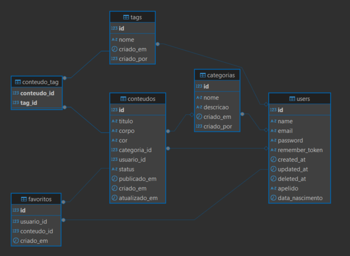

# 🧠 Synapsis

## Autores

Desenvolvido por:

- **Antonio Leoncio Vieira Neto - 2025200194**;
- **Lucas Anderson Ribeiro - 2025200244**;
- **Victor Furtado - 2025200269**.

---

## Este repositório contém o projeto **Synapsis**, um sistema para gerenciamento de conteúdos pessoais (notas, ideias e lembretes).

## 🧩 Estrutura do Projeto

```
front-end-ufg-projeto-final/
│── synapsis-api/   # Backend (Spring Boot + PostgreSQL)
│── synapsis-spa/   # Frontend (React + Vite + TypeScript)
└── README.md       # Este arquivo
```

---

## 🚀 Backend (synapsis-api)

### 🔧 Tecnologias Principais

- **Java 25**
- **Spring Boot 3+**
- **Maven 3.9+**
- **PostgreSQL**
- **Docker & Docker Compose**
- **Swagger/OpenAPI** (documentação da API)

### ▶️ Execução

```bash
cd synapsis-api
./mvnw spring-boot:run
```

A Documentação da API ficará disponível em:  
👉 [http://localhost:5005/swagger-ui/index.html](http://localhost:5005/swagger-ui/index.html)

### 🐘 Banco de Dados (PostgreSQL via Docker)

```bash
docker compose up --build -d
```

**Banco:** synapsis  
**Usuário:** postgres  
**Senha:** postgres  
**Porta:** 5439

### 🧭 Diagrama MER



> O diagrama acima ilustra as entidades principais e seus relacionamentos dentro do sistema.

---

## 💻 Frontend (synapsis-spa)

### 🔧 Tecnologias Utilizadas

- **React 19 + Vite 7**
- **TypeScript**
- **Axios**
- **React Query (@tanstack/react-query)**
- **Bootstrap**
- **React Toastify**
- **React Icons**
- **Topbar**
- **ESLint + Prettier**

### ▶️ Execução

```bash
cd synapsis-spa
npm install
npm run dev
```

A aplicação ficará disponível em:  
👉 [http://localhost:5173](http://localhost:5173)

---

## ✨ Funcionalidades Principais

✅ **CRUD de Usuário** – criar, listar, editar e excluir usuários.  
✅ **CRUD de Conteúdo** – criar, listar, editar e excluir notas.  
✅ **CRUD de Tags** – organizar conteúdos com categorias e etiquetas.
✅ **Busca e Filtragem** – localizar conteúdos rapidamente.  
✅ **Interface Amigável** – design moderno e fluido.  
✅ **Responsividade** – experiência otimizada em desktop, tablet e mobile.

---

## 📄 Documentação do Projeto

- Toda a documentação da API está disponível no **Swagger**.
- O **README.md** inclui instruções completas para instalação e execução.
- O código é estruturado de forma clara para facilitar manutenção e evolução.

## 🏁 Licença

Este projeto é de uso acadêmico e foi desenvolvido como parte da disciplina de **Desenvolvimento Front-End**, ministrada pelo **Prof. MSc. Reinaldo de Souza Júnior**.
